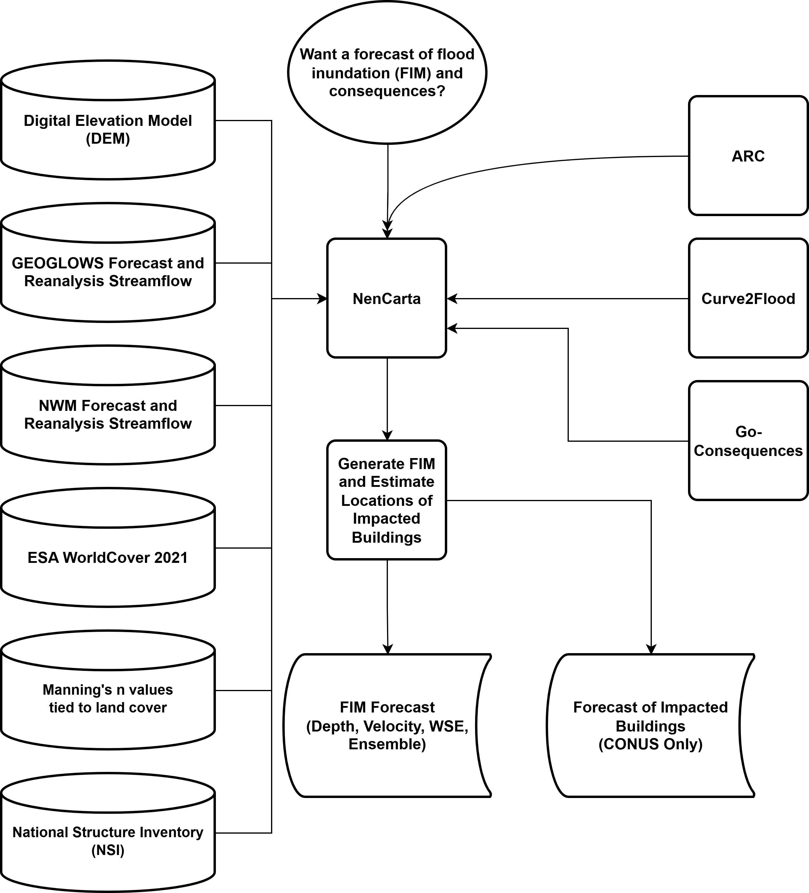

NenCarta documentation
======================

NenCarta automates riverine flood inundation mapping using ARC, Curve2Flood, and forecast streamflow inputs from GEOGLOWS or the National Water Model. It can also estimate direct flood consequences for the coterminous United States with Go-Consequences and the National Structure Inventory.

Contents
--------

.. toctree::
   :maxdepth: 2
   :caption: Guide

   installation
   usage
   configuration
   development

Highlights
----------

* Run NenCarta from the GUI, JSON input files, or the command line.
* Use GEOGLOWS, NWM short-range, NWM medium-range, or NWM long-range streamflow sources.
* Support bathymetry-enabled or bathymetry-disabled flood mapping workflows.
* Optionally estimate flood consequences with a Go-Consequences Docker image.
